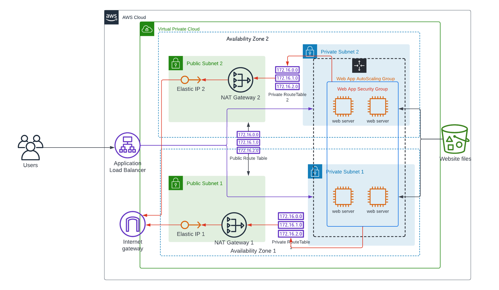

# Udagram_project_2_udacity
Udacity Project 2 : Deploy a High-Availability Web App Using CloudFormation

## Project Title - Deploy a high-availability web app using CloudFormation

This repo contains Cloud Formation Templates to deploy infrastructure shown below: a highly available web site on AWS

 - Network.yml && network-params.json contains template and parameters to deploy the networking components of the infrastructure, such as VPC, Internet Gateway, Private and Public Subnets, etc.
 - Server && server-params.json contains template and parameters to deploy the server components, such as the Application load balancer, Autoscaling group and web servers.
 - storage.yml && storage-params.json contains template and parameters to deploy S3 Bucket containing the app archive
 
 The website is accessible via the Application load balancer created

<!-- **Website URL** :  http://serve-udagr-1h3uie8epb0og-1301418207.us-east-1.elb.amazonaws.com/ -->

#### How to deploy stack
To deploy any of the templates, use the command below upon successfully logging in to the aws cli

    aws cloudformation create-stack \
    	--stack-name "stackName" \
    	--template-body file://network-infrastructure.yml \
    	--parameters file://network-parameters.json \
    	--region=us-east-1 \
    	--capabilities "CAPABILITY_IAM" "CAPABILITY_NAMED_IAM"

